# 公共交通乘客行程系统

[TOC]

## 前言

最初我们决定以公交车为这次公共交通乘客行程系统的主体。

寻找程序设计灵感初期，我们想借鉴百度地图，美团等App关于公交车的功能，但在这些非公交车专属App均没有记录公交车乘坐历史的相关功能，仅提供车辆查询，入站预告，和到站提醒等实时功能，但是显示了公交车行驶路线，可作为程序设计乘车轨迹可视化这一环节的参考。

 我们又想到平时使用的微信和支付宝乘车码，希望在使用的时候会记录下使用记录和公交车历史路线，但很遗憾，仅有乘车消费的记录，以及上车日期及时间。

 最后我们转向“车来了”、“掌上公交”、“易公交”、“智能公交”等公交车专属App，但很遗憾都没有记录乘车历史的相关功能。但智能公交App中的“出行调查”功能给了我们灵感。

 通过对目前市场的自主研究，我们发现了，在当今市场上没有广泛运用的以公共交通行程管理为主体的功能，可能是因为此功能相比于进站提醒，到站提醒，消费记录等功能来说，并不是人们所关注的。

 我们转换思维，鉴于市场似乎并不那么需要广泛的使用这一以公共交通行程管理为主体的功能，我们所要开发的这一工程可以不用像这些大众化的功能一样。我们可以让它服务于个人，像一个服务于个人的公共交通行程记事本一样，记录下自己的行程，就像写日记一般，用户登录后，自己所想看到的，所记录的，均可自主决定。

 因此，这一工程并不像在市场上被广泛运用的与公共交通相关App或者功能一样，为人们的便利服务。设计者对它的期望是，使用它可以成为某个人生活中的一种乐趣形成乘车人的一个小社区，而不是那种几乎无人问津的记录工具。

## 运行环境和配置

### 硬件接口

* 处理器：Intel Pentium 166 MX 或以上。 

* 硬盘：空间 500MB 以上。

* 屏幕适配器：SVGA 接口。

* 系统运行内存：要求 32MB 以上。

### 软件接口

* 开发软件工具：Borland C 3.0

* 文字编辑工具：Visual Studio Code

* 数据库：文本存储（记事本） 

* 操作系统：DOS WINDOWS 9X/ME/2000/XP/WINDOWS 7

### 控制

该系统通过鼠标与键盘直接进行控制。用户将鼠标移至需要操作的功能区进行点击，同时通过键盘来完成登陆、 注册等输入功能。通过中断技术来，获取鼠标的位置与键盘的输入功能。 

## 目标功能

1. 乘客手动录入公交车乘坐记录，并生成行程历史记录（可选择是否加入云端，若加入则可被其他乘客看见）。

2. 乘客可查看历史行程记录。

3. 乘客查看历史行程记录时，能查看相关历史记录的乘客行程记录。

## 需求分析与系统设计
我们设想设计一个公交车乘车用户能够进行简单交流的公共交通行程记录软件，乘客能在这一软件上实现登录、注册、手动添加行程记录、查看历史行程记录、查看同车乘客关联的行程记录并且在地图上可视对应的路线等功能。

 此软件将在基本的登录注册功能的基础上，建立后续功能。

 首先身为一个以用户自主记录公共交通历史行程为主题的系统，它应该具有最基本的自主记录历史行程功能，通过设计者对公共交通历史行程组成的要素的思考和市场研究，最终确定了记录历史行程时所必须三要素，那就是上车站点，下车站点以及上车时间，但犹如前言所说，设计者希望这个系统能成为乘坐公共交通的用户之间进行简单分享甚至是交流的一个小社区，因此我们又为记录行程这一功能添加了一个添加注释的功能，让用户能够简单和自由的分享自己想分享的东西。当然是否让他人能够看到自己的形成甚至是注释也是完全由乘客决定的，用户在完成基本的行程记录后，可以选择是否上传至云端以便能被其他同车乘客看见，这也符合设计者设计这一系统的初衷，即“使用本系统的用户所想记录的，查看的，均由用户自主决定”。

 其次我们要拥有能够显示历史记录的功能，在显示历史记录的板块，用户可通过选择相应的历史行程记录来查看关联此次行程的同车乘客的行程记录。在查看用户自己的行程记录时，地图上会显示对应的行程路线和信息，让文字和图形结合起来，提供更直观的显示服务。对于查看关联乘客的行程记录，如同查看用户自己的行程记录一样，也会显示车次信息及路线。

 当然这些只是一个雏形，是这一系统的基础结构，还有一些设想，在日后更新中会逐渐更新（比如管理员功能，用户功能的优化等）。

 之所以设想添加管理员功能，是因为，此系统操作范围内没有对客户进行限制，随着用户人数偏多，素质良莠不齐，出于维护系统文化环境的健康以及良性的运行，运营者需要对用户的分享至云端的行程记录进行合理的管理。因此，管理员能够查看所有车次关联的乘客信息并调出，并且能够删除用户的行程记录以维护系统的良性运作

 综上所述，根据设计者对公共交通乘客行程系统用户需求的分析和思考，结合对市场上与公共交通相关的App以及其余类型App的与之相关的功能的研究，设计者设计了以下功能：

 根据用户要自主添加行程记录的功能，我们设计了添加键板块，用户通过选中上车点，下车点，输入上车时间，如果有意愿的话可以添加备注，最后选择是否存入云端完成一次行程记录。

 根据用户要查看历史行程记录的要求，我们设计了上拉式查看历史行程记录板块，通过点击查看历史记录，历史记录会实时显示车次、线路、起点站、终点站等信息以及对应的乘车路线（车次：K+车的行程号+车的序列号）并在地图上显示路线。

 根据用户能够查看同车乘客这一要求，我们在查看历史记录面板添加了查看同车乘客选项，查看内容和用户历史行程记录内容相同。

 程序将分为两大板块，他们分别为登陆注册板块和用户界面板块。

登录注册板块：

在登录板块为用户设计欢迎界面，按提示操作后，进入登陆界面，有登录，注册以及退出三种功能选择。用户通过输入已注册过的用户名与密码再点击登录进行登入，点击注册进入注册界面，点击退出关闭程序。

在注册板块，设有用户名，密码，确认密码，姓名四个部分，用户完成输入后，可点击完成来完成注册然后自动返回登陆界面。除注册外还设有返回按键，通过点击可返回登陆界面。

用户界面板块：

 以选定区域地图为底，左上角显示用户姓名，右上角显示添加行程按键，界面下端有上拉式历史菜单按键。

 添加路线板块为乘客提供提示，指引用户完成行程录入。

 历史行程记录板块为乘客提供十六条历史行程信息，分四页显示，板块右上角设有查看同车乘客行程记录按键，通过选定用户自己的行程记录，查看对应记录的同车乘客行程记录。

系统核心功能的运作模式或功能的展望：

关于对用户手动录入行程记录的展望：

1.  用户手动选定地图上同一线路的站点（分别为上车点和下车点）

2.  用户输入上车时间。

3.  用户输入备注（可不输入）。

4.  用户选择是否存入云端（决定你的行程是否可被同车乘客查看）。

PS:需要考虑如何判别车次。

 

关于查看历史行程记录的展望：

1.  点击上拉式菜单的按键打开历史记录查看板块。

2.  显示四条历史记录信息（每面四条，共四面）。

3. 点击每行结尾的“更多”可查看对于该条记录的备注。

4. 点击右上角查看同车乘客，进入同车乘客行程记录查询板块，运行模式不变，乘客数为0~16间随机数（乘客记录的信息如何生成需要考虑，目前设想为在文档里提前制作，随机调用）

关于对管理员这一功能板块的设想：能够查看所有车次关联的乘客信息并调出，并且能够删除用户的行程记录。

 

## 程序板块

 程序分为两大板块分别为登陆注册板块和用户界面板块。

### 登录注册

​		在登录板块为用户设计欢迎界面，按提示操作后，进入登陆界面，有登录，注册以及退出三种功能选择。用户通过输入已注册过的用户名与密码再点击登录进行登入，点击注册进入注册界面，点击退出关闭程序。

​		在注册板块，设有用户名，密码，确认密码，姓名四个部分，用户完成输入后，可点击完成来完成注册然后自动返回登陆界面。除注册外还设有返回按键，通过点击可返回登陆界面。


### 用户界面

以选定区域地图为底，左上角显示用户姓名，右上角显示添加行程按键，界面下端有上拉式历史菜单按键。

添加路线板块为乘客提供提示，指引用户完成行程录入。

历史行程记录板块为乘客提供十六条历史行程信息，分四页显示，板块右上角设有查看同车乘客行程记录按键，通过选定用户自己的行程记录，查看对应记录的同车乘客行程记录。

 


## 项目流程

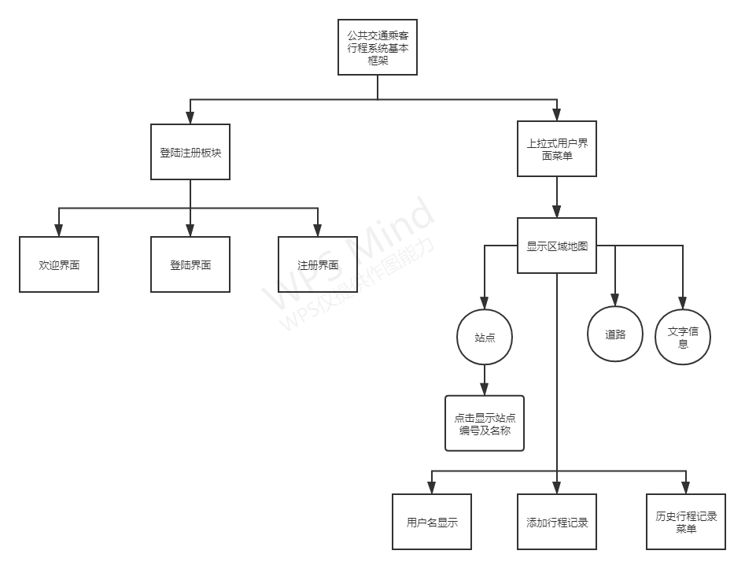


1. 进入登录函数，画出登录界面。提供注册和退出接口。
2. 用户注册时，经过几道查重次序后，将用户信息存入`struct UserInfo`中，为此用户单独创建一个信息文件存放于`userinfo`目录下，并将此文件命名为此用户账户名。同时，将用户名存入`userinfo/userlist`文件中汇总。
3. 成功登陆后进入功能函数，画出地图和用户界面。图中标红的为公交站点，点击即可查看该站点信息。左下角蓝色按钮为上拉式用户菜单，点击即可查看历史乘车记录信息，点击某条记录可以显示该记录的路线图形表示，点击同车乘客按钮可以打开同车乘客菜单。在同车乘客菜单中点击某一乘客，即可显示该乘客此车次的路径图形表示。打开菜单后再次单击蓝色按钮可以收回菜单。效果图如下。

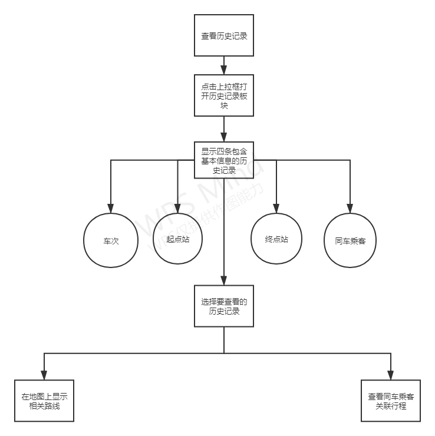

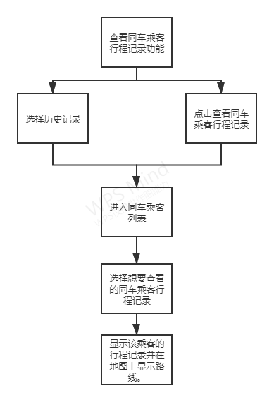

4. 点击右上角`+`按钮可以为本用户添加一条乘车信息记录，系统会将其记录入库，如果该用户历史记录已达16条，则会采用`LRU Strategy`，即覆盖最久远一次记录。

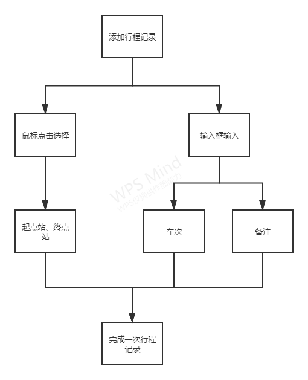

## 用户界面效果图

### 用户界面流程

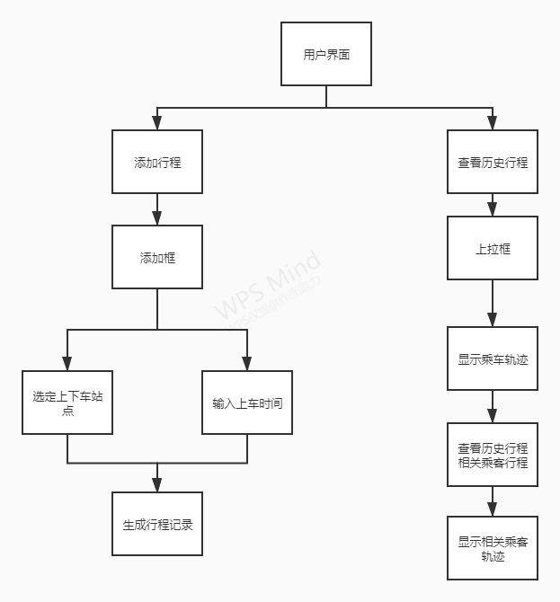


### 引导界面

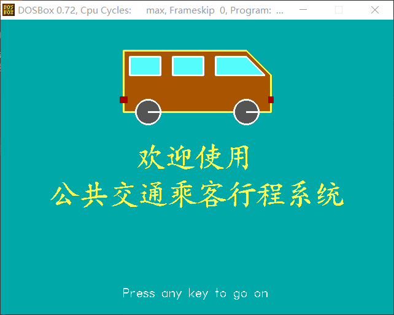

### 登录界面

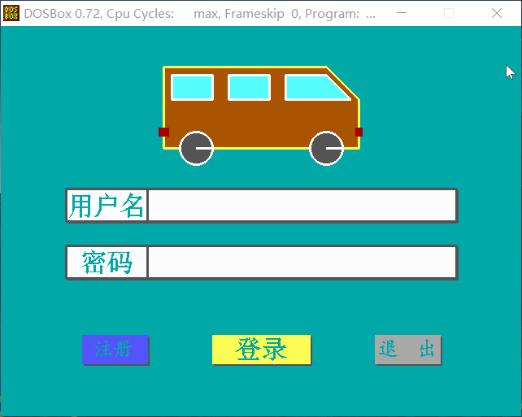

### 注册界面

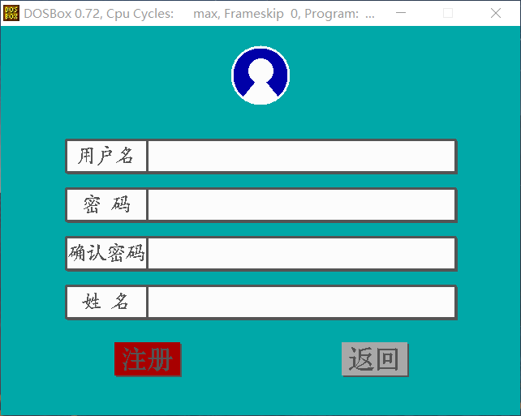

### 地图主界面

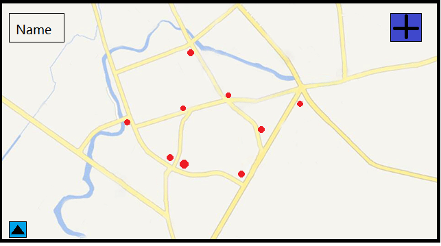

### 路径显示示意

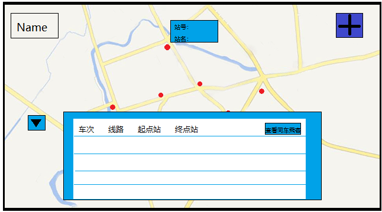

### 关联乘客界面


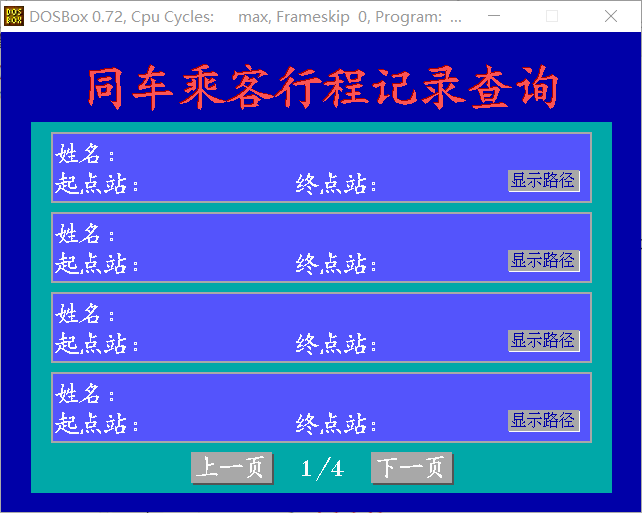

## 核心功能实现

### 记录乘客历史乘车信息：

​    	读取`userinfo/`目录下的用户文件，存入用户一次乘车记录的公交线路、起点站、终点站。

### 显示路线轨迹：

​		在`traveldata/`目录下的文件中保存了任意两个站点间的路径信息文件，文件中存放该路径经过的像素点。显示轨迹时，读取该信息文件并对文件中的每个像素点染色即可。

### 同车乘客存取

​		对每个车次新建一个数据文件保存在`traveldata/`目录下，文件中保存搭乘此车次的用户以及他们分别在此车次对应的信息。显示同车乘客时读取该车次文件并显示即可。

## 信息结构体

```c
/*
像素点结构体{
  (x, y): 像素点坐标
}
*/
typedef struct Locations {
  int x, y;
} Dots;

/*
车站信息结构体{
  (x, y): 车站坐标点
  number: 车站号码
  name: 车站名
}
*/
typedef struct Station {
  int x, y, number;
  char name[32];
} Sta;
// station: a circle on (x,y) with certain R

/*
公交路线结构体{
  station_numbers: 公交路线途经站点
}
*/
typedef struct LinesStations {
  int station_numbers[10];
} Lines;

/*
图形界面路线结构体{
  ndots: 此条路径像素点数量
}
*/
typedef struct RoadsOnMap {
  int ndots;
} Roads;

/*
乘车记录信息结构体{
  line_no: 公交车号码
  start: 起点站
  end: 终点站
}
*/
typedef struct HistoryLinesInfomation {
  int line_no, start, end;
} HisLi;

/*
用户信息结构体{
  nhistory: 用户历史乘车记录数
  name: 用户名
  history_lines: 用户历史乘车信息
}
*/
typedef struct UserInfomation { 
  int nhistory;
  char name[16];
  HisLi history_lines[16];
} UserInfo;
```


## 程序信号

​		在项目中引入信号，便于判断函数执行状况。

```c
/*
STATUS_CODE{
  EXIT_CODE = 0: 退出信号
  SUCCESS_CODE = 1: 成功信号
  ERROR_CODE = -1: 错误信号
}
*/
typedef enum {
  EXIT_CODE = 0,
  SUCCESS_CODE = 1,
  ERROR_CODE = -1,
}STATUS_CODE;
```

## 函数声明（石鸿浩）

### `button.h`

```C

/*
  function lightbutton： 
  输入参数：输入框参数lflag
  函数功能：判定输入框，高亮边框，深化输入框，标记正在进行输入的输入框 
  返回值：无
*/   
void lightbutton(int lflag);

/*
  function recoverbutton： 
  输入参数：输入框代号rflag 
  函数功能：判定输入框，还原输入框
  返回值：无
*/   
void recoverbutton(int rflag);   
```

### `funcbut.h`

```c

/*
  function His_InforBox： 
  输入参数：结构体UserInfo 
  函数功能：一个上拉式菜单，能保留16条历史路线信息，一页四条，
  共四页，分别显示 车次，路线，起点站，终点站信息，并且可以查看同车乘客信息
  返回值：无 
*/ 
void His_InforBox(UserInfo user); 

/*
  function name_box： 
  输入参数：结构体UserInfo
  函数功能：在屏幕左上角显示用户名
  返回值：无
*/
 void name_box(UserInfor user)
 
/*
  function Add_button： 
  输入参数：无
  函数功能：画点击录入记录按钮
  返回值：无
*/
void Add_button();    
```

### `input.h`

```c

/*
  function OvertInput： 
  输入参数：字符串指针id，输入位置x1与y1,输入最多位数
  函数功能：登录时账号输入
  返回值：无
*/  
void OvertInput(char *id,int x1,int y1,int charnum);//登陆注册界面无需隐藏项的输入

/*
  function PaInput： 
  输入参数：字符串指针id，输入位置x1与y1,输入最多位数
  函数功能：登录时密码输入（以 "*" 代替） 
  返回值：无
*/  
void PaInput(char *id,int x1,int y1,int charnum);//登陆注册界面的密码输入（“*”）


```

### `register.h`

```C
/*
  function RegFunc：
  输入参数：无
  函数功能：用户注册
  返回值：无
*/ 
void RegFunc();

/*
  function PasswordUnmatch： 
  输入参数：无 
  函数功能：注册时的输入信息的评判，当两次输入的密码不一样时，会在
  界面下方显示两次输入的密码不一致 200毫秒后消失 
  返回值：无 
*/ 
void PasswordUnmatch();//两次输入密码不一致
/*
  function RepeatedName： 
  输入参数：无 
  函数功能：注册时的输入信息的评判，当输入的用户名已存在时,会在
  界面下方显示用户名已存在 200毫秒后消失 
  返回值：无 
*/ 
void RepeatedName();//用户名已存在
```

### `welcome.h`

```c
/* 
  function DrawEntryWindow： 
  输入参数：无
  函数功能：绘制登录界面
  返回值：无
*/  
void DrawEntryWindow();

/*
  function WrongAccount： 
  输入参数：无 
  函数功能：登录时的输入信息的评判，当输入的用户名不存在时，会在
  界面下方显示 用户名不存在 200毫秒后消失 
  返回值：无 
*/ 
void WrongAccount();//用户名不存在

/*
  function WrongPassword： 
  输入参数：无 
  函数功能：登录时的输入信息的评判，当输入的密码不正确时，会在
  界面下方显示 密码不正确 200毫秒后消失 
  返回值：无 
*/ 
void WrongPassword();//密码错误
```


## 函数声明（王绍宇）

### `putbmp.h`

提供贴图函数接口

```C
/*
function PutBmp:
    传入参数: (图片左上角相对像素位置， 图片路径)
    功能: 贴图
    返回值：成功返回SUCCESS_CODE,失败返回ERROR_CODE
*/
STATUS_CODE PutBmp(int x, int y, char* path);
```

### `register.h`

```c
/*
function CheckEntryId:
    传入参数:（用户名， 用户密码）
    功能：登录时检验用户名是否存在以及密码是否正确
    返回值：成功返回SUCCESS_CODE,失败返回ERROR_CODE
*/
STATUS_CODE CheckEntryId(char *account, char *passwd);

/*
function CheckRegId:
    传入参数：（用户账户，用户名）
    功能：注册时检查用户账户及用户名是否和已存在用户重复
    返回值：成功返回SUCCESS_CODE,失败返回ERROR_CODE
*/
STATUS_CODE CheckRegId(char *account, char *name);

/*
function RegisterFunc:
    传入参数：无
    函数功能：登录总控制框架，加载图形界面，画出登录界面，提供退出接口按钮和注册接口按钮
    返回值：成功返回SUCCESS_CODE,失败返回ERROR_CODE
*/
STATUS_CODE RegisterFunc();

/*
function RunFunc:
    传入参数: 无
    功能: 登录后进入此函数，控制运行总框架
    返回值：成功返回SUCCESS_CODE,失败返回ERROR_CODE
*/
STATUS_CODE RunFunc();

```

### `run.h`

```C
/*
function GetUserInfo:
    传入参数：(用户信息结构地址, 用户账号)
    功能：从用户文件中取得用户信息并存入*user结构体中
    返回值：成功返回SUCCESS_CODE,失败返回ERROR_CODE
*/
STATUS_CODE GetUserInfo(UserInfo *user, char *user_account);

/*
function PrintUseName:
    传入参数：(用户名)
    功能：在DrawRunWindow函数中调用，在界面左上角显示出用户名
    返回值：成功返回SUCCESS_CODE,失败返回ERROR_CODE
*/
STATUS_CODE PrintUseName(char *user_name);

/*
function DrawRunWindow:
    传入参数: （用户信息结构体）
    功能：画出基本用户界面
    返回值：成功返回SUCCESS_CODE,失败返回ERROR_CODE
*/
STATUS_CODE DrawRunWindow(UserInfo *user);

```

### `travel.h`

```c
/*
function NewUserForBus:
    传入参数：(车次，用户名，起点站，终点站)
    函数功能：将一名用户（）添加到该车次信息中
    返回值：成功返回SUCCESS_CODE,失败返回ERROR_CODE
*/
STATUS_CODE NewUserForBus(char *bus_sequence, char *name, int start, int end);

/*
function PrintRoad:
    传入参数: (起点站，终点站)
    函数功能：在地图上显示出起点到终点轨迹图形并自动显示起点站和终点站信息框
    返回值：成功返回SUCCESS_CODE,失败返回ERROR_CODE
*/
STATUS_CODE PrintRoad(int start, int end);

/*
function PrintPassengers:
    传入参数：（车次，当前用户名）
    函数功能：新开一个菜单界面，显示出同车乘客在此车次记录的文本信息，并提供显示其路径接口按钮
    返回值：成功返回SUCCESS_CODE,失败返回ERROR_CODE
*/
STATUS_CODE PrintPassengers(char *bus_sequence, char *name); 

```

### `userdata.h`

```c
	/*
function AddNewUser:
    传入参数: (用户账户, 用户名字)
    功能: 添加一个新用户，为其新建用户文件存于userinfo/目录下，并将此用户名字及账号汇总入userinfo/namelist文件中
    返回值：成功返回SUCCESS_CODE,失败返回ERROR_CODE
*/
STATUS_CODE AddNewUser(char *account, char *name);

/*
function UserNewTravel:
    传入参数: (用户账户, 一条历史记录, 用户信息结构体)
    功能: 为用户添加一条新的行程记录，记录存入cur中，用cur写入到pre_user结构体中并更新该用户信息文件
    返回值：成功返回SUCCESS_CODE,失败返回ERROR_CODE
*/
STATUS_CODE UserNewTravel(char *account, HisLi cur, UserInfo *pre_user);

```

